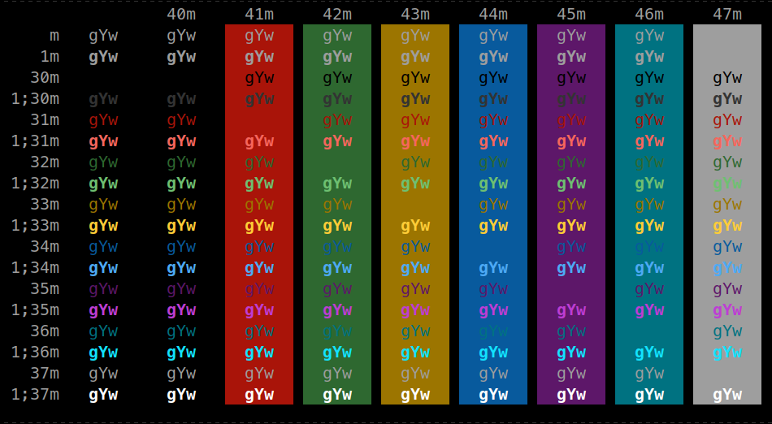

# W3CSS XFCE4 Terminal Color Scheme

## Description

Color scheme from [W3CSS Themes] for XFCE4 Terminal

[W3CSS Themes]: https://www.w3schools.com/w3css/w3css_color_themes.asp

## Screenshot

## Installation

Copy the `w3css.theme` file inside:

* `/usr/share/xfce4/terminal/colorschemes` to make it available for all users,
* `~/.local/share/xfce4/terminal/colorschemes` to make it available only for you.

Go to Edit -> Preferences -> Colors -> Presets and select `W3CSS`.
